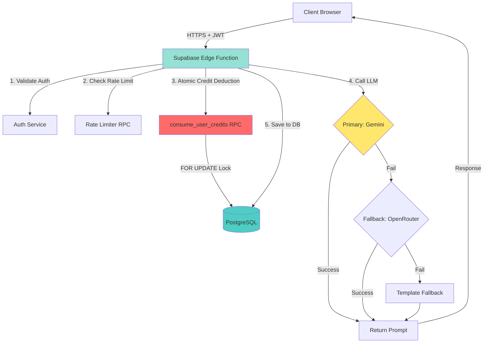

# 🎨 Vibe Prompting

<div align="center">

**Enterprise-Grade AI Prompt Generator with Secure Credit System**

Transform your ideas into powerful AI prompts with military-grade security. Built with React, TypeScript, Supabase Edge Functions, and powered by Google Gemini 2.0 Flash.

[](https://vibe-prompting.vercel.app/)
[](https://vercel.com)

[](./LICENSE)
[](https://www.typescriptlang.org/)
[](https://reactjs.org/)
[](https://vitejs.dev/)
[](https://tailwindcss.com/)
[](https://supabase.com/)

[🚀 Live Demo](https://vibe-prompting.vercel.app/) • [📖 Documentation](#-documentation) • [🤝 Contributing](./CONTRIBUTING.md) • [🔒 Security](./SECURITY.md)

</div>

---

## 🌟 What is Vibe Prompting?

**Vibe Prompting** is a production-ready, enterprise-grade AI prompt generation platform that helps developers, content creators, and AI enthusiasts craft perfect prompts for their AI applications. Built with security-first architecture, it features atomic credit transactions, rate limiting, and multi-tier LLM fallback systems.

### 🎯 Why Vibe Prompting?

- **🔒 Production-Ready Security** - Race-condition-proof credit system with idempotency keys
- **⚡ Blazing Fast** - Built with Vite 7.2, Supabase Edge Functions (Deno)
- **🎨 Beautiful UI** - Neo-brutalist design with smooth Framer Motion animations
- **🤖 Smart AI** - Gemini 2.0 Flash → OpenRouter → Template fallback chain
- **📦 Zero Trust Architecture** - Server-side only credit deduction, RLS policies, no source maps in production

---

## 📑 Table of Contents

- [🌟 What is Vibe Prompting?](#-what-is-vibe-prompting)
- [✨ Features](#-features)
- [🏗️ Architecture](#️-architecture)
- [🛠️ Tech Stack](#️-tech-stack)
- [🚀 Quick Start](#-quick-start)
- [📁 Project Structure](#-project-structure)
- [🔐 Security Features](#-security-features)
- [📖 Documentation](#-documentation)
- [🎮 Usage Guide](#-usage-guide)
- [🔮 Future Implementations](#-future-implementations)
- [🤝 Contributing](#-contributing)
- [📝 License](#-license)
- [📧 Contact](#-contact)

---

## ✨ Features

<table>
<tr>
<td width="50%">

### 🚀 Core Capabilities
- ✅ **AI Prompt Generation** - Powered by Google Gemini 2.0 Flash & OpenRouter
- ✅ **Tiered Generation** - Basic (1 credit), Advanced (3 credits), Expert (5 credits)
- ✅ **Smart Fallback Chain** - Gemini → OpenRouter → Template-based
- ✅ **Real-time Updates** - Live credit tracking via Supabase realtime
- ✅ **Public Gallery** - Discover & share community prompts
- ✅ **Advanced Search** - Filter by category, tags, date

</td>
<td width="50%">

### 🎯 User Experience
- ✅ **10 Free Credits** - For registered users on signup
- ✅ **Dark/Light Theme** - Neo-brutalist design with smooth transitions
- ✅ **One-Click Copy** - Instant clipboard functionality
- ✅ **Fully Responsive** - Desktop, tablet & mobile optimized
- ✅ **Toast Notifications** - Real-time feedback for all actions
- ✅ **PKCE Auth Flow** - Secure authentication with Supabase

</td>
</tr>
</table>

---

## 🏗️ Architecture

### 🔐 V2 Security Architecture



### 💾 Database Schema

**Key Tables:**
- `profiles` - User data with credits & tier
- `prompts` - Generated prompts with metadata
- `request_log` - Idempotency tracking (prevents double-spend)
- `rate_limits` - Per-user rate limiting (10 req/min default)

**Security:**
- Row Level Security (RLS) on all tables
- Users can only SELECT/UPDATE their own data
- Credits ONLY modifiable via server-side RPC functions
- Service role key never exposed to client

---

## 🔐 Security Features

### 🛡️ Production-Grade Security

<table>
<tr>
<td width="50%">

#### Atomic Transactions
```sql
-- Row-level locking prevents race conditions
SELECT credits FROM profiles 
WHERE id = user_id 
FOR UPDATE;  -- 🔒 Critical!
```

**Why?** Prevents concurrent requests from deducting credits multiple times.

</td>
<td width="50%">

#### Idempotency Keys
```typescript
const requestId = `${userId}-${timestamp}-${random}`
```

**Why?** If user clicks "Generate" twice, only one request processes.

</td>
</tr>
<tr>
<td width="50%">

#### Rate Limiting
- **10 requests per minute** per user
- **429 status** with `Retry-After` header
- Sliding window implementation

</td>
<td width="50%">

#### Zero Source Maps
```typescript
build: {
  sourcemap: false,
  terser: { drop_console: true }
}
```

**Production:** No readable source code in browser DevTools

</td>
</tr>
</table>

### 🔒 Additional Security Layers

- ✅ **CSRF Protection** - Token validation on forms
- ✅ **Input Sanitization** - XSS prevention with DOMPurify
- ✅ **Password Strength** - Enforced requirements with visual feedback
- ✅ **Session Management** - Auto-refresh tokens, secure storage
- ✅ **RLS Policies** - Database-level access control
- ✅ **Environment Separation** - VITE_ prefix for public vars only

📚 [Read full security documentation →](./SECURITY.md)

---

## 🛠️ Tech Stack

<table>
<tr>
<td width="33%">

### Frontend
- ⚛️ **React 18.3** - UI library
- 📘 **TypeScript 5.5** - Type safety
- ⚡ **Vite 7.2** - Build tool with HMR
- 🎨 **Tailwind CSS 3.4** - Utility-first styling
- 🎬 **Framer Motion** - Smooth animations
- 🛣️ **React Router v6** - Client-side routing
- 🔔 **React Hot Toast** - Notifications

</td>
<td width="33%">

### Backend & Database
- 🗄️ **Supabase** - BaaS platform
- 🐘 **PostgreSQL** - Relational database with RLS
- ⚡ **Edge Functions** - Deno-based serverless
- 🔐 **Row Level Security** - Database-level ACL
- 🔄 **Realtime** - Live data subscriptions
- 📊 **RPC Functions** - Server-side business logic

</td>
<td width="33%">

### AI & APIs
- 🤖 **Gemini 2.0 Flash** - Primary LLM
- 🦙 **OpenRouter** - Fallback (Llama 3.2, etc.)
- 🔑 **API Keys** - Server-side only (Edge Functions)
- 🎯 **Tiered Generation** - Basic/Advanced/Expert
- 🔄 **Fallback Chain** - Automatic retry logic

</td>
</tr>
</table>

### 🛠️ Development Tools

- 📦 **npm** - Package manager
- 🔍 **ESLint** - Code linting
- 🎨 **PostCSS** - CSS processing
- 🔨 **Terser** - Production minification
- 🚀 **Vercel** - Deployment platform

---

## 🚀 Quick Start

> **📋 Prerequisites:** Node.js 18+, npm, Supabase account (free), Gemini API key (free)

### 1️⃣ Clone the Repository

```bash
git clone https://github.com/Addy-shetty/Vibe-Prompting.git
cd Vibe-Prompting
```

### 2️⃣ Install Dependencies

```bash
npm install
```

### 3️⃣ Set Up Environment Variables

Copy `.env.example` to `.env.local`:

```bash
cp .env.example .env.local
```

**Required variables:**
```env
# Supabase (Get from: https://app.supabase.com/project/_/settings/api)
VITE_SUPABASE_URL=your_supabase_project_url
VITE_SUPABASE_ANON_KEY=your_supabase_anon_key

# Edge Function Secrets (Set via Supabase CLI - NEVER in .env!)
# These are for reference only - set them using: npx supabase secrets set
SUPABASE_SERVICE_ROLE_KEY=your_service_role_key
GEMINI_API_KEY=your_gemini_api_key              # https://aistudio.google.com/apikey
OPENROUTER_API_KEY=your_openrouter_key          # https://openrouter.ai/keys (optional)
```

> ⚠️ **Security Note:** Service role key and API keys should ONLY be set as Edge Function secrets, never in client-side .env files!

### 4️⃣ Set Up Supabase

#### Option A: Using Supabase CLI (Recommended)

```bash
# Install Supabase CLI
npm install -g supabase

# Login to Supabase
npx supabase login

# Link to your project
npx supabase link --project-ref YOUR_PROJECT_REF

# Push database migrations
npx supabase db push

# Set Edge Function secrets
npx supabase secrets set GEMINI_API_KEY="your-key"
npx supabase secrets set OPENROUTER_API_KEY="your-key"
npx supabase secrets set SUPABASE_SERVICE_ROLE_KEY="your-service-role-key"

# Deploy Edge Function
npx supabase functions deploy generate-prompt
```

#### Option B: Manual Setup

1. Create tables by running migrations in [Supabase SQL Editor](https://app.supabase.com)
2. Copy SQL from `supabase/migrations/20240101000000_init_schema.sql`
3. Copy SQL from `supabase/migrations/20241120000000_v2_security_system.sql`

📚 [Detailed setup guide →](./IMPLEMENTATION_SUMMARY.md)

### 5️⃣ Start Development Server

```bash
npm run dev
```

🎉 Visit **http://localhost:5173**

### 6️⃣ Build for Production

```bash
# Create production build (source maps disabled, console.log removed)
npm run build

# Preview production build locally
npm run preview
```

Visit **http://localhost:4173** to test production build

### 7️⃣ Deploy to Vercel

```bash
# Install Vercel CLI
npm i -g vercel

# Deploy
vercel --prod
```

Don't forget to set environment variables in Vercel dashboard!

---

## 📁 Project Structure

```
vibe-prompting/
├── src/
│   ├── components/           # Reusable React components
│   │   ├── ui/              # Shadcn/ui components (tiles, cards, etc.)
│   │   ├── CreditDisplay.tsx
│   │   ├── Hero.tsx
│   │   ├── Navbar.tsx
│   │   └── PasswordStrengthIndicator.tsx
│   ├── pages/               # Page components (routes)
│   │   ├── DashboardPage.tsx
│   │   ├── GeneratePromptPageSecure.tsx  # ✅ V2 Secure version
│   │   ├── MyPromptsPage.tsx
│   │   ├── LoginPage.tsx
│   │   └── SignupPage.tsx
│   ├── context/             # React Context API
│   │   ├── AuthContext.tsx         # Authentication state
│   │   └── ThemeContext.tsx        # Dark/light mode
│   ├── hooks/               # Custom React hooks
│   │   └── useCreditsSecure.ts     # ✅ V2 Secure credit hook
│   ├── lib/                 # Utilities & API clients
│   │   ├── api.ts                  # ✅ Edge Function client
│   │   ├── supabase-client.ts      # ✅ Browser-safe Supabase client
│   │   ├── supabase.ts             # Re-export for compatibility
│   │   ├── security.ts             # XSS, CSRF, rate limiting
│   │   ├── validations.ts          # Zod schemas
│   │   └── utils.ts                # General utilities
│   ├── styles/              # Global styles
│   │   └── index.css               # Tailwind + custom CSS
│   ├── App.tsx              # Main app component with routes
│   └── main.tsx             # Entry point
├── supabase/
│   ├── functions/           # Edge Functions (Deno)
│   │   └── generate-prompt/
│   │       └── index.ts            # ✅ V2 Secure prompt generation
│   └── migrations/          # Database migrations
│       ├── 20240101000000_init_schema.sql
│       └── 20241120000000_v2_security_system.sql  # ✅ Latest
├── docs/                    # Documentation
│   ├── AUTH_GUIDE.md
│   ├── SUPABASE_SETUP.md
│   └── THREAT_MODEL.md
├── .github/                 # GitHub configs
│   └── instructions/        # Copilot instructions
├── dist/                    # Production build output
├── public/                  # Static assets
├── IMPLEMENTATION_SUMMARY.md  # ✅ Complete V2 implementation guide
├── SECURITY.md              # Security policy
├── CONTRIBUTING.md          # Contribution guidelines
├── package.json
├── tsconfig.json
├── tailwind.config.cjs
├── vite.config.ts           # ✅ Production hardening (no source maps)
└── vercel.json              # Vercel deployment config
```

### 🔑 Key Files Explained

| File | Purpose |
|------|---------|
| `src/lib/api.ts` | Client-side Edge Function calls with idempotency |
| `supabase/functions/generate-prompt/index.ts` | Server-side prompt generation with credit deduction |
| `supabase/migrations/20241120000000_v2_security_system.sql` | RPC functions, rate limiting, idempotency tracking |
| `src/hooks/useCreditsSecure.ts` | Read-only credit fetching with real-time updates |
| `vite.config.ts` | Production build config (no source maps, minification) |
| `IMPLEMENTATION_SUMMARY.md` | Complete V2 security implementation documentation |

---

## 📖 Documentation

### 📚 Core Documentation
| Document | Description |
|----------|-------------|
| [🔒 Security Policy](./SECURITY.md) | Vulnerability reporting & security measures |
| [🤝 Contributing Guide](./CONTRIBUTING.md) | How to contribute to this project |
| [📜 MIT License](./LICENSE) | Open source license details |

### 🔧 Technical Guides
| Guide | Description |
|-------|-------------|
| [🔐 Authentication](./docs/AUTH_GUIDE.md) | Auth implementation & user flows |
| [💳 Credits System](./docs/CREDITS_SYSTEM.md) | How credits work & limitations |
| [🗄️ Database Setup](./docs/SUPABASE_SETUP.md) | Supabase configuration & migrations |
| [🛡️ Security Details](./docs/SECURITY_IMPLEMENTATION_FULL.md) | Complete security implementation |

### 🔗 Quick Links
- 📋 [.env.example](./.env.example) - Environment variables template
- 🗂️ [supabase/migrations](./supabase/migrations/) - Database migration files
- 🧩 [src/components](./src/components/) - React components
- 🎣 [src/hooks](./src/hooks/) - Custom React hooks

---

## 🎮 Usage Guide

### 🎭 For Anonymous Users

1. 🏠 **Visit Homepage** - Explore example prompts
2. 🎯 **Click a Category** - Choose your prompt type
3. ✨ **Generate** - Create up to 3 free prompts
4. 📋 **Copy** - One-click clipboard copy
5. 💾 **Sign Up** - To save prompts permanently

> ⚠️ **Note:** Anonymous prompts are stored in localStorage and may be lost

### ✨ For Registered Users

1. 📝 **Sign Up** - Get 50 free credits instantly
2. 🎨 **Generate Prompts** - Use your credits wisely
3. 🏷️ **Add Tags** - Organize with up to 5 tags
4. 🌍 **Make Public** - Share with the community
5. 📚 **Browse Gallery** - Discover & save others' prompts
6. ⚙️ **Manage** - Edit or delete your creations

### 💡 Pro Tips

- 🎯 **Be Specific** - More detailed inputs = better prompts
- 🏷️ **Choose Correct Tier** - Basic (quick), Advanced (detailed), Expert (comprehensive)
- 📊 **Monitor Credits** - Displayed in navbar and dashboard
- 🔄 **Check Provider** - See which AI model generated your prompt (Gemini/OpenRouter/Fallback)
- 💾 **Save Prompts** - All prompts auto-saved to your profile
- 🌍 **Share Public** - Help the community & get discovered

---

## 🔮 Future Implementations

### 🎯 Planned Features (V3)

#### 🔐 Security & Performance
- [ ] **Blockchain-based Credit Ledger** - Immutable transaction history
- [ ] **Advanced Rate Limiting** - Per-IP, per-endpoint, per-tier limits
- [ ] **WebAuthn Support** - Passwordless authentication with biometrics
- [ ] **Redis Caching** - Cache frequently used prompts
- [ ] **CDN Integration** - Cloudflare for static assets
- [ ] **DDoS Protection** - Cloudflare WAF rules
- [ ] **Audit Logs** - Complete user action tracking
- [ ] **2FA Authentication** - TOTP/SMS two-factor auth

#### 🤖 AI & Generation
- [ ] **Custom AI Models** - GPT-4, Claude, Mistral integration
- [ ] **Prompt Templates** - Pre-built templates for common use cases
- [ ] **Prompt Chaining** - Multi-step prompt generation
- [ ] **AI Prompt Analyzer** - Score & suggest improvements
- [ ] **Batch Generation** - Generate multiple prompts at once
- [ ] **Prompt Versioning** - Track prompt evolution
- [ ] **A/B Testing** - Test different prompt variations
- [ ] **Prompt Marketplace** - Buy/sell premium prompts

#### 💳 Monetization
- [ ] **Stripe Integration** - Credit top-ups via card
- [ ] **Subscription Plans** - Free, Pro, Enterprise tiers
  - Free: 10 credits/month
  - Pro: 100 credits/month + advanced features ($9.99/mo)
  - Enterprise: Unlimited + white-label ($99/mo)
- [ ] **Referral Program** - Earn credits by inviting friends
- [ ] **Credit Packages** - One-time credit purchases
- [ ] **Team Billing** - Shared credit pools for organizations

#### 🎨 User Experience
- [ ] **Prompt History Graph** - Visualize generation patterns
- [ ] **Favorites System** - Star prompts for quick access
- [ ] **Prompt Collections** - Organize prompts into folders
- [ ] **Export Options** - PDF, JSON, Markdown formats
- [ ] **Collaborative Prompts** - Share & edit with team
- [ ] **Prompt Commenting** - Add notes and feedback
- [ ] **Advanced Filters** - Filter by date, tier, provider, success rate
- [ ] **Keyboard Shortcuts** - Power user features

#### 📊 Analytics & Insights
- [ ] **Usage Dashboard** - Credits, generations, success rates
- [ ] **Popular Prompts** - Community trending prompts
- [ ] **Prompt Analytics** - Success rate, avg tokens, cost
- [ ] **User Leaderboard** - Top contributors & generators
- [ ] **API Usage Stats** - Gemini vs OpenRouter vs Fallback
- [ ] **Cost Tracking** - Real-time API cost monitoring

#### 🌐 Community Features
- [ ] **Prompt Voting** - Upvote/downvote community prompts
- [ ] **User Profiles** - Public profile pages with stats
- [ ] **Following System** - Follow your favorite creators
- [ ] **Prompt Remixing** - Fork & modify public prompts
- [ ] **Community Challenges** - Weekly prompt competitions
- [ ] **Badges & Achievements** - Gamification elements

#### 🛠️ Developer Features
- [ ] **REST API** - Public API for developers
- [ ] **Webhooks** - Real-time event notifications
- [ ] **SDK/Libraries** - JavaScript, Python, Go clients
- [ ] **CLI Tool** - Generate prompts from terminal
- [ ] **VS Code Extension** - Generate prompts in editor
- [ ] **Obsidian Plugin** - Note-taking integration
- [ ] **Zapier Integration** - Automation workflows
- [ ] **Make.com Integration** - No-code automation

#### 🌍 Internationalization
- [ ] **Multi-language Support** - UI in 10+ languages
- [ ] **RTL Support** - Arabic, Hebrew, etc.
- [ ] **Currency Support** - Multi-currency payments
- [ ] **Regional Compliance** - GDPR, CCPA, etc.

#### 📱 Mobile & Desktop
- [ ] **Mobile Apps** - React Native iOS/Android apps
- [ ] **Desktop App** - Electron app for Windows/Mac/Linux
- [ ] **PWA Support** - Install as standalone app
- [ ] **Offline Mode** - Generate prompts offline (cached templates)

#### 🧪 Advanced Features
- [ ] **Prompt Playground** - Test prompts with different LLMs
- [ ] **Prompt Optimizer** - AI-powered prompt improvement
- [ ] **Cost Calculator** - Estimate API costs before generation
- [ ] **Prompt Scheduler** - Schedule generation at specific times
- [ ] **Bulk Import/Export** - CSV, JSON batch operations
- [ ] **Prompt Templates Engine** - Create reusable prompt templates
- [ ] **Custom Variables** - Dynamic prompt placeholders

### 🗓️ Roadmap Timeline

| Quarter | Focus Area | Status |
|---------|------------|--------|
| Q1 2025 | V2 Security Implementation | ✅ Complete |
| Q2 2025 | Stripe Integration + Pro Plans | 🔄 In Progress |
| Q3 2025 | Mobile Apps + API Launch | 📅 Planned |
| Q4 2025 | AI Model Marketplace | 📅 Planned |
| Q1 2026 | Enterprise Features | 📅 Planned |

### 💬 Feature Requests

Have an idea? [Open a feature request](https://github.com/Addy-shetty/Vibe-Prompting/issues/new?labels=enhancement) and let's discuss!

---

## 🤝 Contributing

We ❤️ contributions! Whether it's bug reports, feature requests, or code contributions - all are welcome!

### 🚀 Quick Contribution Steps

1. 🍴 **Fork** the repository
2. 🌿 **Create** a feature branch
   ```bash
   git checkout -b feature/AmazingFeature
   ```
3. 💻 **Code** your changes
4. ✅ **Commit** with clear messages
   ```bash
   git commit -m 'feat: Add AmazingFeature'
   ```
5. 📤 **Push** to your branch
   ```bash
   git push origin feature/AmazingFeature
   ```
6. 🎯 **Open** a Pull Request

### 📋 Contribution Guidelines

Please read our [**Contributing Guide**](./CONTRIBUTING.md) for:
- 📜 Code of Conduct
- 🛠️ Development setup
- 💻 Coding standards
- ✉️ Commit message conventions
- 🧪 Testing requirements

### 🐛 Found a Bug?

[Open an issue](https://github.com/Addy-shetty/Vibe-Prompting/issues) with:
- Clear description
- Steps to reproduce
- Expected vs actual behavior
- Screenshots (if applicable)

### 💡 Feature Request?

We'd love to hear your ideas! [Create a feature request](https://github.com/Addy-shetty/Vibe-Prompting/issues) and describe:
- The problem it solves
- Proposed solution
- Alternative approaches

---

## 📝 License

This project is licensed under the **MIT License** - see the [**LICENSE**](./LICENSE) file for details.

### 📜 What This Means

✅ **Commercial use** - Use it in your business  
✅ **Modification** - Change and customize freely  
✅ **Distribution** - Share with anyone  
✅ **Private use** - Use for personal projects  

⚠️ **Conditions:**
- Include copyright notice
- Include license copy

📖 [Read the full MIT License →](./LICENSE)

---

## 🙏 Acknowledgments

This project wouldn't be possible without these amazing tools and services:

| Technology | Purpose | License |
|------------|---------|---------|
| [Google Gemini](https://ai.google.dev/) | AI prompt generation | Google AI |
| [Supabase](https://supabase.com/) | Backend infrastructure | Apache 2.0 |
| [React](https://reactjs.org/) | UI framework | MIT |
| [TypeScript](https://www.typescriptlang.org/) | Type safety | Apache 2.0 |
| [Tailwind CSS](https://tailwindcss.com/) | Styling | MIT |
| [Framer Motion](https://www.framer.com/motion/) | Animations | MIT |
| [Vite](https://vitejs.dev/) | Build tool | MIT |

Special thanks to:
- 🌟 All [contributors](https://github.com/Addy-shetty/Vibe-Prompting/graphs/contributors)
- 🐛 Bug reporters and testers
- 💡 Feature requesters
- ⭐ Everyone who starred this repo

---

## 📧 Contact

<div align="center">

### Harshith M S (Addy Shetty)

[](https://github.com/Addy-shetty)
[](mailto:Harshithms@gmail.com)

</div>

### 💬 Get in Touch

- 💼 **GitHub:** [@Addy-shetty](https://github.com/Addy-shetty)
- 📧 **Email:** Harshithms@gmail.com
- 🐛 **Issues:** [Report bugs](https://github.com/Addy-shetty/Vibe-Prompting/issues)
- 💡 **Discussions:** [Join conversations](https://github.com/Addy-shetty/Vibe-Prompting/discussions)

---

<div align="center">

### 🌟 Show Your Support

If you find this project useful, please consider:

⭐ **Starring this repository**  
🍴 **Forking and contributing**  
🐛 **Reporting bugs**  
💡 **Suggesting features**  
📢 **Sharing with others**

---

**Made with ❤️ by [Addy Shetty](https://github.com/Addy-shetty)**

[](https://github.com/Addy-shetty/Vibe-Prompting/stargazers)
[](https://github.com/Addy-shetty/Vibe-Prompting/network/members)
[](https://github.com/Addy-shetty/Vibe-Prompting/issues)

**Thank you for visiting! Happy Prompting! 🎨✨**

[⬆ Back to Top](#-vibe-prompting)

</div>
